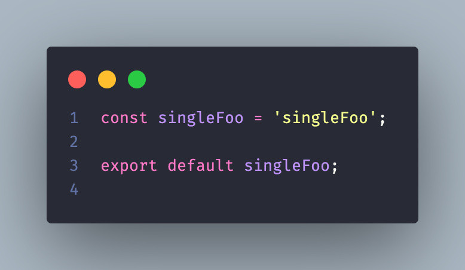
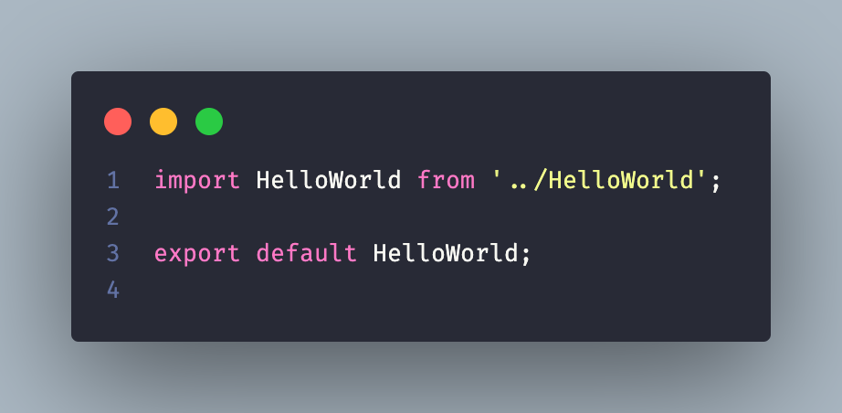
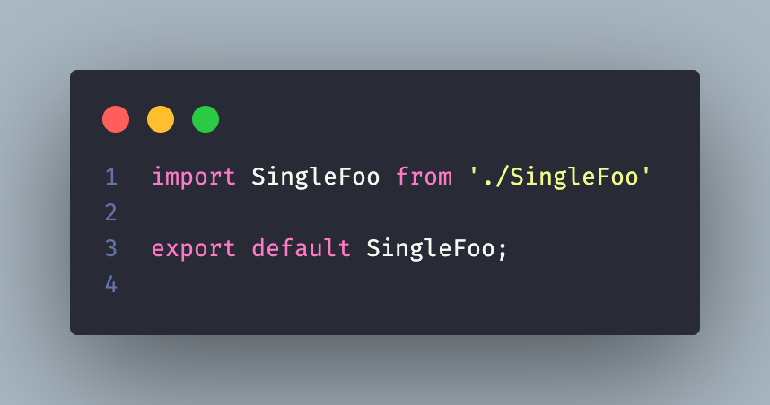
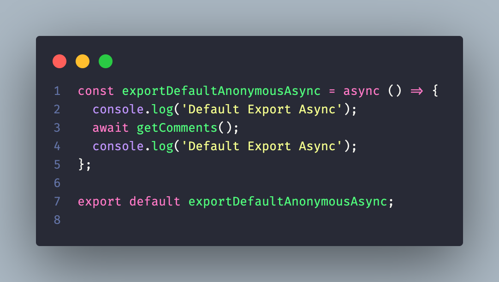
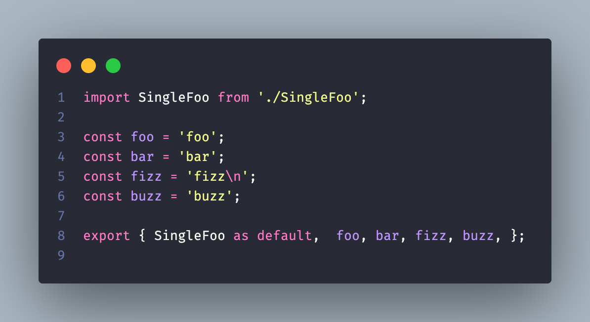
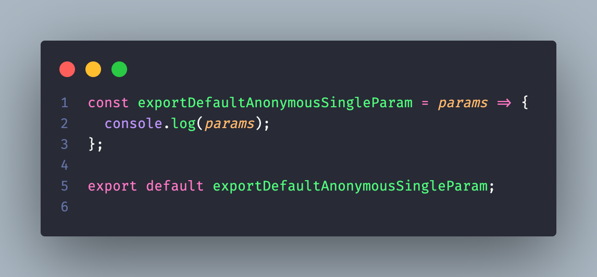
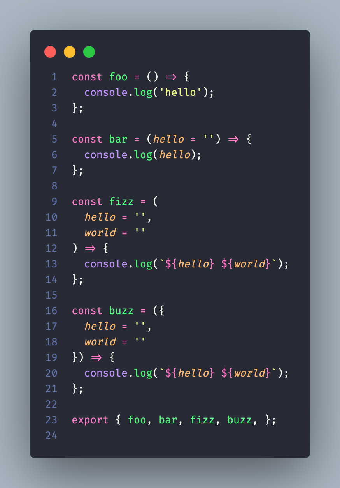
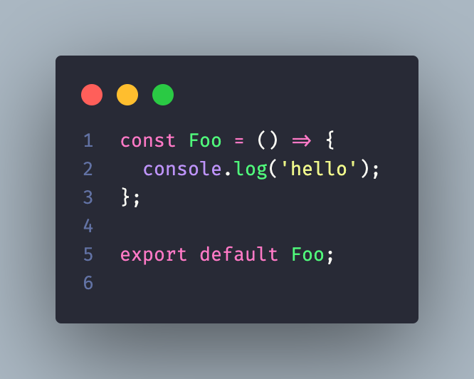
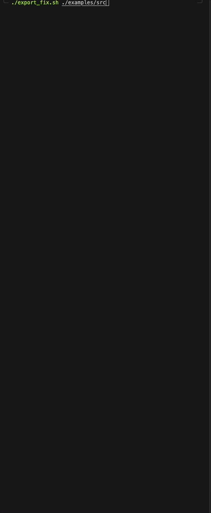

# **Autofix** for `eslint-plugin-import`: group export syntaxes at the bottom using `Bash`

## Why? 🤔
  You're dealing with thousands of js/ts files with these syntaxes and just want to make things prettier by putting exports at the bottom but there's no autofix from the library yet

## Rules to fix
> for mixed export list + an export default: check `./examples/src/mixedExports*.js` or create your own mixed export syntaxes based off of `Before` section to test

- [import/exports-last](https://github.com/import-js/eslint-plugin-import/blob/v2.25.3/docs/rules/exports-last.md)
- [import/no-anonymous-default-export](https://github.com/import-js/eslint-plugin-import/blob/v2.25.3/docs/rules/no-anonymous-default-export.md)
- [import/group-exports](https://github.com/import-js/eslint-plugin-import/blob/v2.25.3/docs/rules/group-exports.md)
- [make aggregating modules valid in group-exports](https://github.com/import-js/eslint-plugin-import/pull/1472)
- [import/prefer-default-export](https://github.com/import-js/eslint-plugin-import/blob/main/docs/rules/prefer-default-export.md)

### Before
  - ```js
    export const foo = 'foo';
    export const bar = 'bar';
    export const fizz = 'fizz\n';
    export const buzz = 'buzz';
    ```
  - ```js
    export default () => { // file name: HelloComponent.js
      console.log('Hello World!');
    };
    ```
  - ```js
    import { one, two, three } from './number';

    export default { // file name: numbers.js
      1: one,
      2: two,
      3: three,
    };
    ```
  - ```js
    export { default as HelloWorld } from '../HelloWorld';
    export { default as FooBar } from '../../FooBar';
    export { default as FizzBuzz } from '../../../FizzBuzz';
    ```
  - ```js
    export const singleFoo = 'singleFoo';
    ```
  - ```js
    export { default as HelloWorld } from '../HelloWorld';
    ```
  - ```js
    export { default } from './SingleFoo'
    ```
  - ```js
    export default async () => { // file name: exportDefaultAnonymousAsync.js
      console.log('Default Export Async');
      await getComments();
      console.log('Default Export Async');
    };
  - ```js
    import SingleFoo from './SingleFoo';

    export const foo = 'foo';
    export const bar = 'bar';
    export const fizz = 'fizz\n';
    export const buzz = 'buzz';

    export default SingleFoo;
    ```
  - ```js
    export default params => { // file name: exportDefaultAnonymousSingleParam.js
      console.log(params);
    };
    ```
  - ```js
    export function foo() {
      console.log('hello');
    };

    export function bar(hello = '') {
      console.log(hello);
    };

    export function fizz(
      hello = '',
      world = ''
    ) {
      console.log(`${hello} ${world}`);
    };

    export function buzz({
      hello = '',
      world = ''
    }) {
      console.log(`${hello} ${world}`);
    };
    ```
  - ```js
    export default function Foo() {
      console.log('hello');
    };
    ```
  - ```js
    export default function () { // file name: exportDefaultUnnamedFunction.js
      console.log('hello');
    };
    ```

### After












## Usage / Testing
> current supported files [.js,jsx,ts,tsx]

### for a single file
```bash
./export_fix.sh ./examples/src/exportNamed.js
```
  *sanitize supported file*

```bash
./export_fix.sh ./examples/src/sampleDir/mixedExports1.js
```
  *sanitize file with mixed syntaxes of export*

```bash
./export_fix.sh ./examples/src/sampleDir/exportNamedSingle.js
```
  *sanitize file with single named export to prefer default*
### for all files in a directory
```bash
./export_fix.sh ./examples/src/sampleDir
```
  *sanitize supported files available in specified directory*

### for all files and all subdirectories in a directory
```bash
./export_fix.sh ./examples/src
```
  *sanitize supported files and subdirectories available in src*

## reset script
- to reset **examples/src/*** files after overwriting: `./reset.sh`
- just don't mess with the files from **examples/backup/*** 🤷

## Notes
- will skip any unsupported files or empty directories
- will notify if a file is already sanitized with the given syntaxes in `Before` section
- supports parsing codebase with lowercase/uppercase const/function naming convention
- supports parsing codebase with or without semicolon (by default, generated bottom export will have a semicolon)
- supports parsing codebase with single quotes or double quotes
- to avoid infinite loop, do not call `./export-fix.sh .`
- if permission denied: `chmod 777 ./export_fix.sh` which is the only file you need for your codebase located in the root
- if available, execute your eslint then prettier in your codebase after running the script for additional 💅

## For enhancement
- `export default PushNotification.configure({
  foo,
  bar,
  fizz,
  buzz,
})`

## Sample - execute script for all files and subdirectories
### unsanitized


### sanitized

