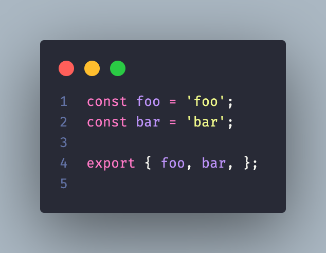
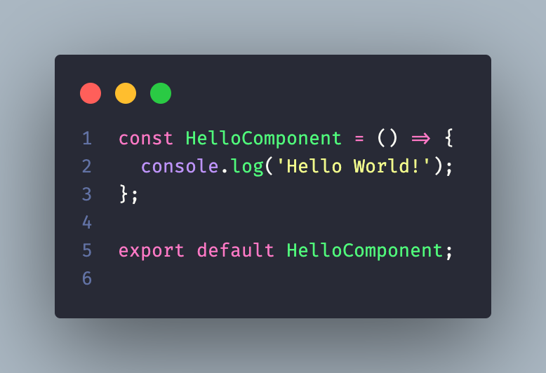
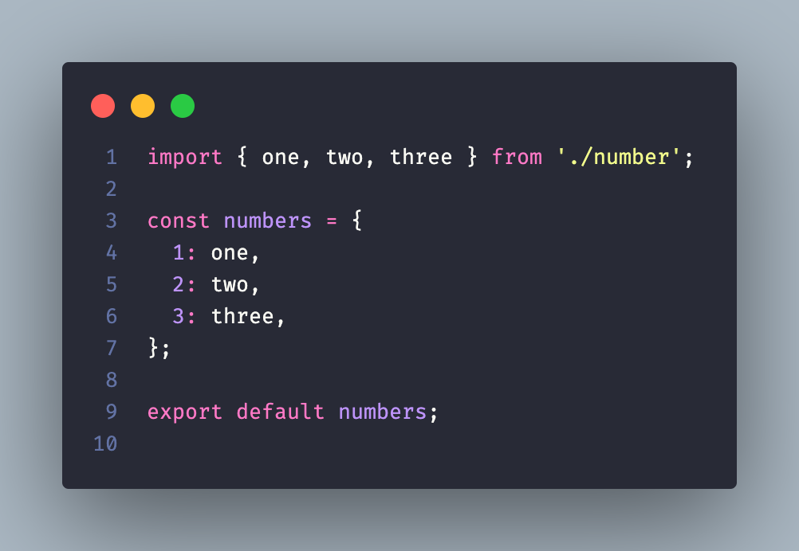
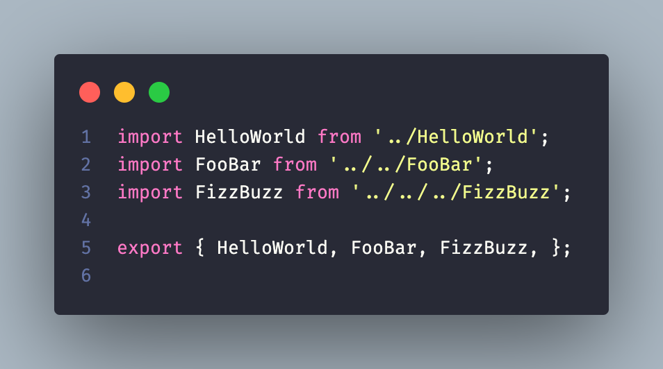

# **Export fixes** for `eslint-plugin-import` using `Bash`

## Why? 🤔
- You're dealing with thousands of js/ts files with these syntaxes and just want to make things prettier by putting exports at the bottom but there's no autofix yet

## Rules to fix
- [import/exports-last](https://github.com/import-js/eslint-plugin-import/blob/v2.25.3/docs/rules/exports-last.md)
- [import/no-anonymous-default-export](https://github.com/import-js/eslint-plugin-import/blob/v2.25.3/docs/rules/no-anonymous-default-export.md)
- [import/group-exports](https://github.com/import-js/eslint-plugin-import/blob/v2.25.3/docs/rules/group-exports.md)
- [import/prefer-default-export](https://github.com/import-js/eslint-plugin-import/blob/main/docs/rules/prefer-default-export.md)

### Before
  - ```js
    export const foo = 'foo'
    export const bar = 'bar'
    ```
  - ```js
    export default () => { // file name: HelloComponent.js
      console.log('Hello World!');
    };
    ```
  - ```js
    import { one, two, three } from './number';

    export default { // file name: numbers.js
      1: one,
      2: two,
      3: three,
    };
    ```
  - ```js
    export { default as HelloWorld } from '../HelloWorld';
    export { default as FooBar } from '../../FooBar';
    export { default as FizzBuzz } from '../../../FizzBuzz';
    ```

### After





## Usage / Testing
> current supported files [.js,jsx,ts,tsx] 
### for a single file
- ```bash
  ./export_fix.sh ./examples/src/exportNamed.js # sanitize file
  ```
- ```bash
  ./export_fix.sh ./examples/src/sampleDir/mixedExports1.js  # sanitize file
  ```

### for all files in a directory
- ```bash
  ./export_fix.sh ./examples/src/sampleDir  # sanitize supported files available in directory
  ```

### for all files and all sub-directories in a directory
- ```bash
  ./export_fix.sh ./examples/src  # sanitize supported files and sub-directories available
  ```

### reset script
- to reset **examples/src/*** files after overwriting: `./reset.sh`
- just don't mess with the files from **examples/backup/*** 🤷

### notes
- script will skip any unsupported files or empty directories
- script will notify if a file is already sanitized with the given syntaxes in `Before` section
- to avoid infinite loop, do not call `./export-fix.sh .`
- if permission denied: `chmod 777 ./export_fix.sh` which is the only file you need for your codebase located in the root
- if available, execute prettier in your js/ts codebase after running the script for additional 💅
